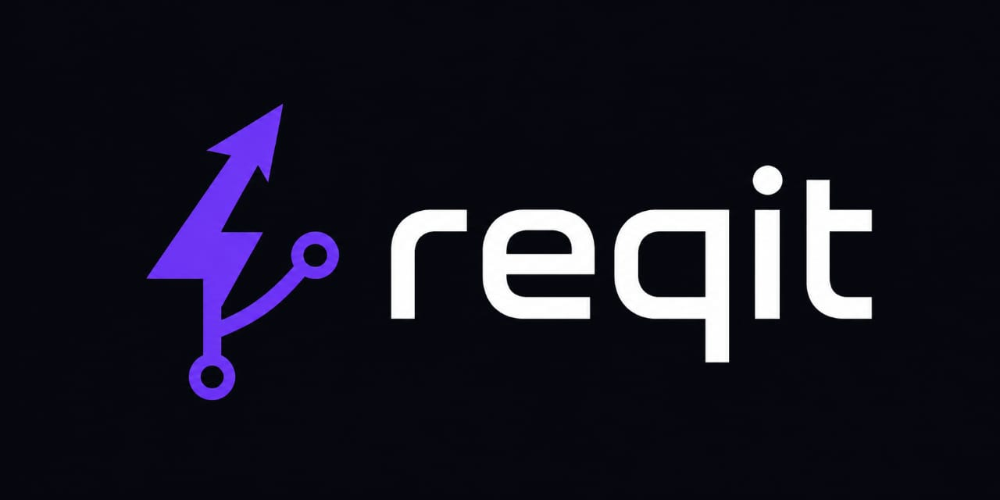

<p align="center">
  
</p>

<h1 align="center">reqit</h1>
<p align="center">local-first, Git-native API client. No account. No cloud. No Electron.</p>

<p align="center">
  <a href="https://github.com/HalxDocs/reqit/releases/latest"></a>
  <a href="https://github.com/HalxDocs/reqit/releases/latest"></a>
  <a href="#"></a>
  <a href="LICENSE"></a>
  <a href="https://github.com/HalxDocs/reqit/stargazers"></a>
  <a href="https://github.com/HalxDocs/reqit/releases/latest"></a>
</p>

<p align="center">
  
</p>

---

## Why reqit

- starts in under **400ms** on a mid-range machine
- collections are **plain JSON files** — commit them to Git like code
- **no account, no telemetry, no cloud dependency** — ever

---

## Install

```bash
curl -LO https://github.com/HalxDocs/reqit/releases/latest/download/reqit-windows-amd64.exe
```

| Platform | File |
|----------|------|
| Windows  | [reqit-windows-amd64.exe](https://github.com/HalxDocs/reqit/releases/latest/download/reqit-windows-amd64.exe) |
| macOS    | [reqit-macos-universal.zip](https://github.com/HalxDocs/reqit/releases/latest/download/reqit-macos-universal.zip) |
| Linux    | [reqit-linux-amd64](https://github.com/HalxDocs/reqit/releases/latest/download/reqit-linux-amd64) |

### Linux dependencies

reqit requires WebKit2GTK to render its UI.

**Ubuntu 24.04+** (default):
```bash
sudo apt install libwebkit2gtk-4.1-0
```

**Ubuntu 22.04 and earlier** (legacy):
```bash
sudo apt install libwebkit2gtk-4.0-37 libjavascriptcoregtk-4.0-18
```

---

## Quick start

1. **Download** reqit for your platform
2. **Import** a Postman collection or paste a cURL command
3. **Select an environment** from the dropdown
4. **Pick a request** and click **Send**
5. **Inspect the response** — status, timing, headers, formatted body

---

## Features

### Core

| Feature | Description |
|---------|-------------|
| HTTP client | GET, POST, PUT, PATCH, DELETE, HEAD, OPTIONS with full response inspection |
| WebSocket / SSE | Real-time bidirectional messaging with message log |
| Socket.IO | Engine.IO v4 client with event emission, cookie/header passthrough |
| GraphQL | Queries, mutations, subscriptions with introspection |
| gRPC | gRPC-web-text unary and streaming via HTTP POST |
| SOAP | SOAP 1.1/1.2 envelope builder with WSDL parsing |
| MQTT | Publish/subscribe with QoS and message history |
| Collection runner | Sequential and concurrent execution with assertions |
| Mock server | One-click local HTTP server with saved responses, delays, overrides |
| Contract testing | Auto-validate responses against OpenAPI specs |
| Cookie jar | Auto-capture and replay `Set-Cookie` with persistent storage |
| Environment variables | `{{VAR}}` interpolation across all request fields |
| Code generation | Export as cURL, JavaScript fetch, Python requests |
| Auth methods | Bearer, Basic, API Key, Digest, NTLM, OAuth2 (PKCE + refresh), JWT decoder |
| Scripting | Pre-request / post-response JavaScript (goja) with variable extraction |

### Collections

| Feature | Description |
|---------|-------------|
| Full CRUD | Create, rename, delete collections and individual requests |
| Virtual scrolling | Handles 1000+ items with zero lag (ResizeObserver + binary search) |
| Drag-and-drop | Reorder collections and requests with visual drop indicators |
| Batch operations | Select, move, delete multiple requests at once |
| Search | Live filter by name with auto-hide empty collections |
| Spec linking | Link a collection to an OpenAPI spec for contract validation |

### Git & Collaboration

| Feature | Description |
|---------|-------------|
| Git-native storage | Collections as JSON files in `.reqit/` — diff, branch, review |
| Full git client | Status, branch management, commit, push, pull, stash, merge |
| PR preview | Side-by-side diff review for API payloads |
| Conflict resolution | Visual merge UI for JSON, headers, form-data (ours/theirs/three-way) |
| Self-hosted sync | Optional WebSocket-based real-time collaboration server |
| Inline comments | Threaded discussions on requests and collections |
| RBAC | Viewer / Editor / Administrator workspace roles |
| Audit logs | Append-only tamper-evident trail with timeline viewer |
| Team invites | Git ref–based invites and permission-wrapped URLs |

### API Design & Docs

| Feature | Description |
|---------|-------------|
| OpenAPI designer | Create and edit specs with endpoint CRUD |
| OpenAPI import | Import yaml/yml/json specs as collections |
| OpenAPI export | Export collections as OpenAPI 3.0.3 JSON or Swagger UI HTML |
| API reference | In-app documentation viewer from linked specs |
| Markdown export | Configurable API docs with headers, body, examples, timestamp |
| Registry push/pull | SwaggerHub and Stoplight integration |

### Testing & Automation

| Feature | Description |
|---------|-------------|
| Assertions | Status code, JSON body, headers, response time checks |
| Test suites | Nested test groups with runner integration |
| Load testing | Configurable virtual users with latency percentiles |
| Reports | JSON and HTML report generation + export |
| CI/CD generation | GitHub Actions, GitLab CI, Jenkins pipeline YAML |
| Test generation | Playwright and Jest (JS/TS) from collections |
| CLI mode | Headless collection execution for CI/CD pipelines |

### Import / Export

| Feature | Description |
|---------|-------------|
| Import | Postman v2.1 (full with pm.\* transpile), Insomnia, Hoppscotch, OpenAPI, cURL |
| Export | Postman, Insomnia, Hoppscotch, OpenAPI (JSON + HTML), Markdown, cURL |

### Security

| Feature | Description |
|---------|-------------|
| OAuth2 | Full authorize / exchange / refresh flow with PKCE |
| Enterprise SSO | SAML 2.0 and OpenID Connect provider management |
| Encryption | AES-256-GCM with Argon2id key derivation |
| Secret vault | 1Password, HashiCorp Vault, AWS Secrets Manager |
| Data masker | Regex-based masking for tokens, keys, secrets |
| Air-gap mode | Disable network features for restricted environments |
| Interceptor proxy | Browser traffic capture via local HTTP proxy + Chrome extension |

### Developer Experience

| Feature | Description |
|---------|-------------|
| Multi-workspace | Create, switch, rename, relocate workspaces with file watcher |
| Theme system | Dark/light with system preference auto-detect |
| Command palette | Cmd+K searchable actions with scoped context filtering |
| Keyboard shortcuts | Every action reachable by keyboard — 45+ registered commands across global, response, sidebar, and env scopes |
| Response formatting | Collapsible JSON tree view, Pretty/Raw/Tree toggle (Ctrl+Shift+R), lazy expansion for large payloads |
| Dev profiles | Publish your developer profile to `reqit.pxxl.dev/:username` with skills, projects, badges, and GitHub activity |
| reqit AI | BYOK error intelligence — paste an error, get diagnosis and generated assertions (requires your own API key) |
| MCP Server | Model Context Protocol server for AI agent integration — collections, environments, history, mock server |
| Agent Lens | Agent-readiness mapper, linter, and export — score your API collections for AI consumption |
| Schema drift detection | Snapshot OpenAPI specs and detect breaking changes between versions |
| Auto-updater | GitHub release checking with one-click install |
| Plugin system | Directory-based plugin discovery and install |
| System tray | Background execution with notifications |
| Telemetry | Opt-in only, zero by default |

---

## GitOps

```text
.reqit/
  collections/
    auth-api/
      login.json
      refresh.json
    payment-service/
      charge.json
  environments/
    dev.json
    staging.json
  exports/
```

Collections commit to Git like any other file. No cloud sync. No proprietary format. Your API collections live alongside your code, diff in pull requests, and branch per feature.

---

## Comparison

| Feature | reqit | Postman | Bruno |
|---------|-------|---------|-------|
| Install size | < 20MB | 300MB+ | < 50MB |
| Account required | Never | Yes | Never |
| Local-first | Yes | No | Yes |
| Git-native storage | Yes | No | Yes |
| Startup time | < 400ms | 5-10s | ~1s |
| Telemetry | Zero | Yes | Optional |
| Collection runner | Yes | Yes | Yes |
| Mock server | Yes | Yes | No |
| OpenAPI import/export | Yes | Yes | Partial |
| WebSocket client | Yes | Yes | Yes |
| Socket.IO client | Yes | No | No |
| GraphQL client | Yes | Yes | No |
| gRPC client | Yes | No | No |
| SOAP client | Yes | Yes | No |
| MQTT client | Yes | No | No |
| Scripting (pre/post) | Yes | Yes | Yes |
| Load testing | Yes | Yes | No |
| CI/CD generation | Yes | No | No |
| SSO / RBAC | Yes | Yes | No |
| Audit logs | Yes | Enterprise | No |
| Self-hosted sync | Yes | No | No |
| Visual git merge | Yes | No | No |
| CLI / CI mode | Yes | No | Yes |
| Keyboard-first UX | Yes (scoped) | Partial | No |
| JSON tree view | Yes | Yes | No |
| Dev profiles | Yes (public) | No | No |
| MCP server | Yes | No | No |
| Agent readiness | Yes | No | No |
| Price | Free / OSS | Free+$12/m | Free / OSS |

---

## Contributing

Issues and pull requests are welcome. See [CONTRIBUTING.md](.github/CONTRIBUTING.md). Keep PRs focused — one feature or fix per PR.

Licensed under the [MIT License](LICENSE).

Built by [HalxDocs](https://halxdocs.com).
